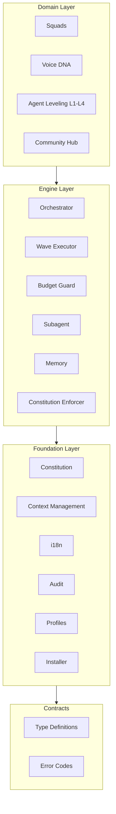

# Architecture Overview

BuildPact is built on a strict 3-layer architecture where each layer has a single responsibility and dependencies flow in one direction only.

## Layer Summary

| Layer | Responsibility |
|-------|---------------|
| **Foundation** | Constitution, context management, project state, installation CLI |
| **Engine** | Pipeline (Quick->Specify->Plan->Execute->Verify+Learn), waves, recovery, memory, budget guards |
| **Domain** | Squads, Voice DNA, agent leveling L1-L4, community hub |



## Source Structure

```
src/
├── cli/          # Entry point (zero business logic)
├── contracts/    # Type definitions and error codes
├── foundation/   # Core utilities (i18n, audit, profiles, scanner, migrator)
├── engine/       # Pipeline engine (orchestrator, wave executor, budget guard)
├── commands/     # Command handlers (one directory per command)
└── squads/       # Squad loader and validator
```

## Key Architectural Rules

1. **Result-based error handling.** Business logic never throws. Every function returns `Result<T, CliError>` so callers always handle failures explicitly.

2. **Strict layered dependencies.** `contracts <- foundation <- engine <- commands <- cli`. No layer may import from a layer above it.

3. **Orchestrator size limits.** Orchestrators must stay at or below 300 lines and consume no more than 15% of the context window. This forces decomposition.

4. **Subagent isolation.** Subagents receive only their task payload. They have no access to shared state, other agents' context, or the orchestrator's internal data.

5. **File-based state.** All state is stored in Markdown, JSON, or YAML files inside the `.buildpact/` directory. There are zero databases.

6. **Auto-sharding.** Any file that exceeds 500 lines is automatically sharded into smaller files with an `index.md` linking them together.

7. **Constitution injection.** The project constitution is injected into every context window, ensuring all agents operate under the same rules.

## Operational Modes

BuildPact supports two operational modes, each targeting different use cases:

### Prompt Mode (v1.0)

Markdown templates combined with slash commands. This mode works in any IDE that supports slash commands (Claude Code, Cursor, Windsurf) and in web interfaces (ChatGPT, Claude.ai). Users copy templates and interact through conversational prompts.

### Agent Mode (v2.0)

A TypeScript CLI with direct session control. Agent Mode provides crash recovery, automatic pipeline advancement, parallel wave execution, and real-time budget tracking. It requires a terminal but delivers full automation.

Both modes share the same constitution, squad definitions, and pipeline logic. The difference is in execution control: Prompt Mode relies on the user to advance each step, while Agent Mode handles advancement automatically.
