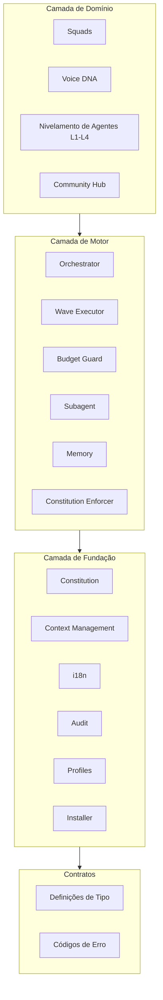

# Visão Geral da Arquitetura

O BuildPact é construído sobre uma arquitetura rígida de 3 camadas, onde cada camada tem uma única responsabilidade e as dependências fluem em uma única direção.

## Resumo das Camadas

| Camada | Responsabilidade |
|--------|-----------------|
| **Fundação** | Constituição, gerenciamento de contexto, estado do projeto, CLI de instalação |
| **Motor** | Pipeline (Quick->Specify->Plan->Execute->Verify+Learn), ondas, recuperação, memória, budget guards |
| **Domínio** | Squads, Voice DNA, nivelamento de agentes L1-L4, community hub |



## Estrutura do Código-Fonte

```
src/
├── cli/          # Ponto de entrada (zero lógica de negócio)
├── contracts/    # Definições de tipo e códigos de erro
├── foundation/   # Utilitários centrais (i18n, auditoria, perfis, scanner, migrador)
├── engine/       # Motor do pipeline (orchestrator, wave executor, budget guard)
├── commands/     # Handlers de comando (um diretório por comando)
└── squads/       # Loader e validador de squads
```

## Regras Arquiteturais

1. **Tratamento de erros baseado em Result.** Lógica de negócio nunca lança exceções. Toda função retorna `Result<T, CliError>`, garantindo que chamadores sempre tratem falhas de forma explícita.

2. **Dependências em camadas estritas.** `contracts <- foundation <- engine <- commands <- cli`. Nenhuma camada pode importar de uma camada acima dela.

3. **Limite de tamanho do Orchestrator.** Orchestrators devem ter no máximo 300 linhas e consumir no máximo 15% da janela de contexto. Isso força a decomposição.

4. **Isolamento de subagentes.** Subagentes recebem apenas o payload da sua tarefa. Não têm acesso a estado compartilhado, contexto de outros agentes ou dados internos do orchestrator.

5. **Estado baseado em arquivos.** Todo estado é armazenado em arquivos Markdown, JSON ou YAML dentro do diretório `.buildpact/`. Zero bancos de dados.

6. **Auto-sharding.** Qualquer arquivo que ultrapasse 500 linhas é automaticamente fragmentado em arquivos menores com um `index.md` que os conecta.

7. **Injeção da constituição.** A constituição do projeto é injetada em toda janela de contexto, garantindo que todos os agentes operem sob as mesmas regras.

## Modos Operacionais

O BuildPact suporta dois modos operacionais, cada um voltado para diferentes cenários de uso:

### Modo Prompt (v1.0)

Templates Markdown combinados com slash commands. Este modo funciona em qualquer IDE que suporte slash commands (Claude Code, Cursor, Windsurf) e em interfaces web (ChatGPT, Claude.ai). Usuários copiam templates e interagem via prompts conversacionais.

### Modo Agente (v2.0)

CLI TypeScript com controle direto de sessão. O Modo Agente oferece recuperação de falhas, avanço automático do pipeline, execução paralela de ondas e rastreamento de custo em tempo real. Requer terminal, mas entrega automação completa.

Ambos os modos compartilham a mesma constituição, definições de squad e lógica de pipeline. A diferença está no controle de execução: o Modo Prompt depende do usuário para avançar cada passo, enquanto o Modo Agente cuida do avanço automaticamente.
