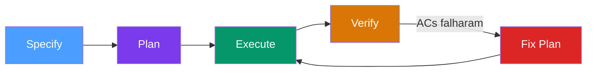

# Fluxo do Pipeline

O BuildPact executa um pipeline de 4 fases onde cada fase produz artefatos que alimentam a próxima. O pipeline é determinístico: a mesma entrada sempre gera a mesma estrutura de saída.

## Visão Geral

## Fase 1: Specify (Especificar)

**Entrada:** Descrição em linguagem natural
**Saída:** `.buildpact/specs/{slug}/spec.md`

O agente PM transforma a descrição do usuário em uma especificação estruturada contendo:

- User story no formato "Como [persona], eu quero [objetivo], para que [motivação]"
- Critérios de aceite numerados e testáveis
- Requisitos funcionais e não-funcionais
- Autoavaliação constitucional

A **detecção de ambiguidade** identifica termos vagos e solicita definições concretas antes de prosseguir.

## Fase 2: Plan (Planejar)

**Entrada:** Spec aprovada
**Saída:** `.buildpact/plans/{slug}/plan.md` + arquivos de onda

O agente Architect gera o plano de implementação:

1. **Pesquisa paralela** — Múltiplos agentes analisam stack, dependências e domínio
2. **Decomposição em ondas** — Tarefas agrupadas por dependência; tarefas de uma mesma onda podem rodar em paralelo
3. **Detecção de etapas humanas** — Revisões e aprovações marcadas como `executor_type: human`
4. **Validação Nyquist** — Verificação multi-perspectiva que busca ACs faltantes, dependências circulares e desvio de escopo

Cada tarefa no plano especifica: agente responsável, arquivos alvo, critérios de aceite vinculados e tipo de executor.

## Fase 3: Execute (Executar)

**Entrada:** Plano aprovado
**Saída:** Commits git + logs de auditoria

O agente Developer implementa o plano onda por onda:

1. **Budget guard** verifica se há orçamento disponível antes de iniciar a onda
2. Cada tarefa roda em um **subagente isolado** que recebe apenas seu payload
3. Ao concluir a tarefa, um **commit git atômico** é criado
4. **Verificação goal-backward** checa a saída da onda contra os ACs da spec
5. Se um AC falha, um **plano de correção** é gerado automaticamente

A execução pode ser interrompida e retomada — o estado persiste em arquivos.

## Fase 4: Verify (Verificar)

**Entrada:** Código implementado
**Saída:** Relatório de verificação

O agente QA conduz o Teste de Aceite do Usuário (UAT):

1. Apresenta cada AC para avaliação do usuário
2. Coleta veredito: Passou, Falhou ou Pulado
3. Para itens que falharam, registra o motivo
4. Gera relatório final com taxa de aprovação
5. ACs reprovados alimentam um **plano de correção** que pode ser reexecutado

## Fluxo Quick

O comando `buildpact quick` oferece três variantes que comprimem o pipeline:

| Variante | O que faz |
|----------|----------|
| `quick "..."` | Gera spec mínima, implementa e faz commit — sem cerimônia |
| `quick "..." --discuss` | 3-5 perguntas de esclarecimento antes de implementar |
| `quick "..." --full` | Roda o pipeline completo (specify + plan + execute + verify) em um só comando |

## Rastreamento de Estado

Cada fase registra seu resultado em `.buildpact/audit/cli.jsonl`. O comando `buildpact status` exibe o estado atual do pipeline com indicadores visuais de progresso.
