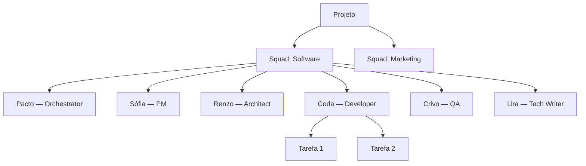

# Arquitetura de Squads

Squads são equipes de agentes IA especializados que colaboram ao longo do pipeline. Cada squad é configurado para um domínio específico e define quem faz o quê em cada fase.

## Hierarquia de 4 Níveis

O BuildPact organiza agentes em uma hierarquia clara:

| Nível | O que é | Exemplo |
|-------|---------|---------|
| **Projeto** | O repositório com sua constituição e configuração | `meu-app/` |
| **Squad** | Uma equipe de agentes para um domínio | Squad de Software |
| **Agente** | Um especialista com papel definido | Renzo (Architect) |
| **Tarefa** | Uma unidade de trabalho atômica | "Criar endpoint REST" |



## Anatomia de 6 Camadas

Todo agente no BuildPact é definido por 6 camadas obrigatórias:

### Camada 1: Identidade

Nome, papel e resumo em uma frase. Define quem o agente é.

```markdown
# Renzo — Architect
Senior software architect specializing in system design and technical decisions.
```

### Camada 2: Regras Operacionais

Instruções concretas de como o agente trabalha: formato de saída, ferramentas que usa, limites que respeita.

### Camada 3: Voice DNA

A personalidade do agente — como ele pensa e se comunica. Contém 5 seções obrigatórias:

- **Personality Anchors** — Traços de caráter específicos com descrição comportamental
- **Opinion Stance** — Posições que o agente defende com convicção
- **Anti-Patterns** — Comportamentos que o agente reconhece e evita
- **Never-Do Rules** — Linhas que o agente nunca cruza
- **Inspirational Anchors** — Referências que inspiram o estilo do agente

A validação do squad (`buildpact squad validate`) rejeita qualquer agente sem as 5 seções de Voice DNA.

### Camada 4: Contexto de Domínio

Vocabulário, padrões e restrições específicas do domínio do squad.

### Camada 5: Exemplos

Amostras de entrada/saída que demonstram o comportamento esperado.

### Camada 6: Constituição

Regras do projeto injetadas automaticamente — o agente não pode ignorá-las.

## Roteamento por Fase

O arquivo `squad.yaml` define qual agente lidera cada fase do pipeline:

| Fase | Agente | Papel |
|------|--------|-------|
| `orchestrate` | Pacto | Orquestra o pipeline e roteia trabalho |
| `specify` | Sófia (PM) | Captura e estrutura requisitos |
| `plan` | Renzo (Architect) | Projeta o plano de implementação |
| `execute` | Coda (Developer) | Implementa as tarefas |
| `verify` | Crivo (QA) | Conduz testes de aceite |
| `document` | Lira (Tech Writer) | Produz documentação |

## Nivelamento de Agentes (L1-L4)

O nível de autonomia de um agente determina quanta liberdade ele tem para tomar decisões:

| Nível | Nome | Comportamento |
|-------|------|--------------|
| **L1** | Assistido | Sempre pede confirmação antes de agir |
| **L2** | Guiado | Age dentro de limites definidos, consulta em casos ambíguos |
| **L3** | Autônomo | Toma decisões técnicas, reporta apenas resultados |
| **L4** | Delegado | Autonomia total dentro do escopo do squad |

O nível inicial é definido no `squad.yaml` (campo `initial_level`) e pode ser ajustado por projeto conforme a confiança no squad aumenta.

## Workflow Chains

Squads definem **cadeias de handoff** determinísticas entre agentes. Quando um agente conclui sua fase, o próximo agente é ativado automaticamente:

```
Pacto → Sófia (specify) → Renzo (plan) → Coda (execute) → Crivo (verify) → Lira (document) → Pacto
```

Cada transição é declarada no `squad.yaml` com `from_agent`, `last_command` e `next_agent`, garantindo que o fluxo seja previsível e auditável.

## Criando Seu Próprio Squad

```bash
# Gera a estrutura de diretórios
buildpact squad create meu-squad

# Valida a definição
buildpact squad validate

# Testa o comportamento dos agentes
buildpact doctor --smoke
```

A estrutura gerada:

```
.buildpact/squads/meu-squad/
├── squad.yaml       # Metadados, roteamento, workflow chains
└── agents/
    ├── chief.md     # Agente líder (obrigatório)
    └── *.md         # Especialistas adicionais
```

Para mais detalhes sobre como definir a personalidade dos agentes, consulte a seção Voice DNA acima.
